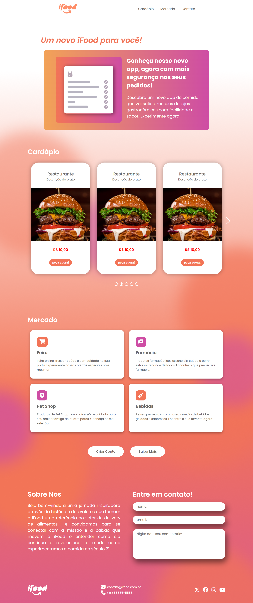

<h1 align="center"> Projeto Redesign iFood 🛵 </h1>

  <a href="#-tecnologias">Tecnologias</a>&nbsp;&nbsp;&nbsp;|&nbsp;&nbsp;&nbsp;
  <a href="#-projeto">Projeto</a>&nbsp;&nbsp;&nbsp;|&nbsp;&nbsp;&nbsp;
  <a href="#-creditos">Integrantes</a>&nbsp;&nbsp;&nbsp;

 

  

 

## 💻 Projeto

O projeto consiste em um redesign da marca iFood. Tal desafio foi proposto na aula do curso **Vem Ser Tech - Front-End da Ada Tech em parceria com o iFood** e deve levar em consideração otimização para SEO e responsividade para mobile e desktop. O trabalho foi realizado em grupo, na sessão "Integrantes" você pode acompanhar o trabalho de cada um dos Devs.
  

## 📝 Integrantes

- [Layna Moraes](https://github.com/laynamoraes)
- [Luisa Correia](https://github.com/luisacs923)
- [Maiky Caires](https://github.com/MaikyCaires)
- [Thay Jarosz](https://github.com/ThayJarosz)

  

## 🚀 Tecnologias

Esse projeto foi desenvolvido com as seguintes tecnologias:

- HTML
- CSS
